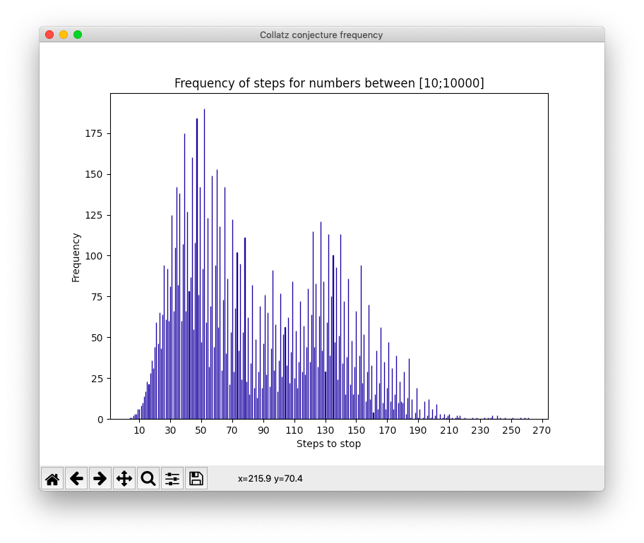

# Collatz Conjecture

Collatz Conjecture implemented in Python.
Front-end: Matplotlib.

Compute number of collatz conjecture steps to reach 1.
```python
>>> collatz_stop_steps(39)
34
```

Plot a histogram in range between n1 and n2.
```python
>>> plot_histogram(10, 10000)
```
